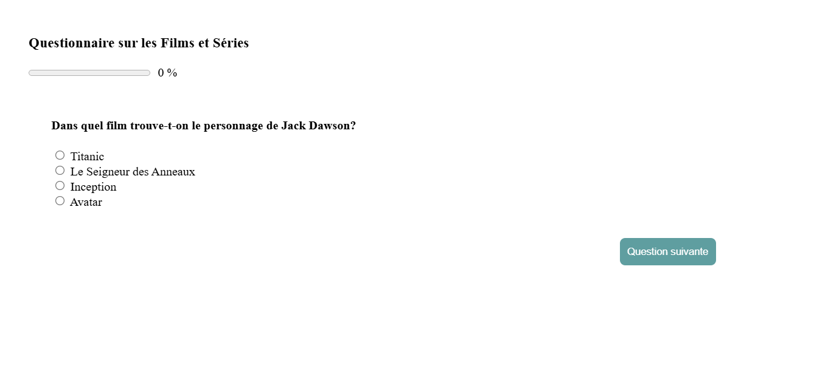

## Aperçu

## Description

Il s'agit d'une application de Quiz réalisée avec Vue.js. Les questions et leurs réponses sont récupérés depuis un fichier json. 

Ce projet aussi simple qu'il soit m'a permis de travailler les notions comme: les composants, les props, les enfants des composants, le cycle de vie d'un composant, les watchers et la syntaxe de base.

